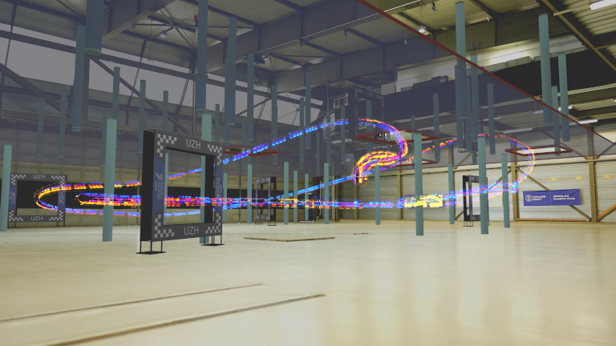

## Minimum-Time Quadrotor Waypoint Flight in Cluttered Environments

Code for paper: 
R. Penicka, D. Scaramuzza, "Minimum-Time Quadrotor Waypoint Flight in Cluttered Environments", in Robotics and Automation Letters (RAL), 2022.

Paper: [https://rpg.ifi.uzh.ch/docs/RAL22_Penicka.pdf](https://rpg.ifi.uzh.ch/docs/RAL22_Penicka.pdf) 
Video: [https://youtu.be/TIvvHtzRwSo](https://youtu.be/TIvvHtzRwSo)

The code has been developed and tested on Ubuntu 20.04.

### Downloading the code
Clone the code repository and update the submodules. 
`git clone https://github.com/uzh-rpg/sb_min_time_quadrotor_planning.git` 
`cd sb_min_time_quadrotor_planning` 
`git submodule update --init --recursive`

### Compilation and dependencies

Install following dependencies: 
`sudo apt-get install build-essential cmake pkg-config ccache zlib1g-dev libomp-dev libyaml-cpp-dev libhdf5-dev libgtest-dev liblz4-dev liblog4cxx-dev libeigen3-dev python3 python3-venv python3-dev python3-wheel python3-opengl` 

Compile first the dependencies present in submodules using 
`make dependencies` 

Afterwards you can compile the code using 
`make`

### Maps preparation

To create the ESDF maps from the mesh .obj fles use the map.py script in the python folder. To have all the dependencies we suggest using the python environment.
Start the environment and activate it using: 
`python3 -m venv env` 
`source env/bin/activate` 
Afterwards install the python dependencies using pip (or pip3 if python3 is not default): 
`pip install wheel` 
`pip install pyopengl==3.1.0` 
`pip install numpy trimesh matplotlib mesh_to_sdf python-csv`

When the dependencies are installed run the following commands in the python folder to create the ESDF maps.
`./map.py ../blender/random_columns.obj` 
`./map.py ../blender/repairing_office.obj` 
`./map.py ../blender/arena_track_obstacles_multistory.obj`

### Running the code

After compilation you should see the main binary. The main cofiguration file is the sst.yaml where the desired waypoints and map can be set. The drone.yaml file includes configuration of the used quadrotor. The found trajectory is afterwords in file path_dense.csv. To run the code simply run command: 
`./main`
